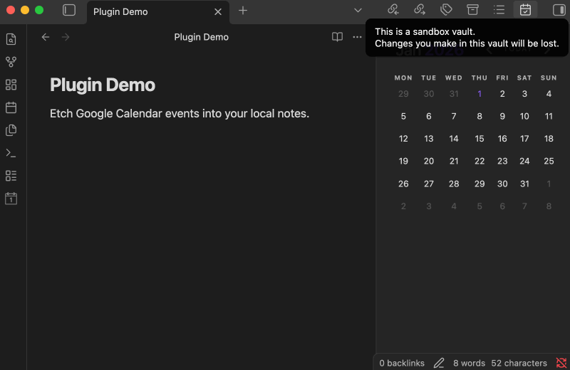

# Obsidian Plugin - Etch - Google Calendar

An Obsidian plugin that etches daily Google Calendar events into your notes for permanent, local,
offline access.

[](https://www.buymeacoffee.com/parente)



## Why?

I've been using [gcalcli](https://github.com/insanum/gcalcli) to output a text agenda at the command
line and then copy/pasting it into my daily note for years now. I like how the info becomes a
permanent part of the local Makrdown file, and shows up in a simple editable format.

I haven't created an Obsidian plugin since
[obsidian-overdue](https://github.com/parente/obsidian-overdue), and wanted to try my hand at
automating the "etching" of Google Calender events into my Obsidian notes.

## Setup

I've submitted this plugin for inclusion in the [Obsidian Community Plugins list](https://obsidian.md/plugins). You can one-click install it from there once it's approved. Until then, you can use the [BRAT plugin](https://tfthacker.com/BRAT) to install a release from this repository.

You also need to create a (free) Google Cloud Platform project with access to the Google Calendar
API in the Google Workspace account where your calendar resides. Then you need to create an OAuth
2.0 client in the project, and set the client ID and client secret in the plugin settings in
Obsidian.

This first few sections of [this
quickstart](https://developers.google.com/workspace/calendar/api/quickstart/nodejs) explain the
steps in a bit more detail. Stop when you get to installing libraries or writing code.

Once you have the OAuth client info, configure the plugin with it and authorize access to your
calendar in the [Obsidian settings](https://help.obsidian.md/settings).

Note that the plugin only works on Obsidian desktop because it needs to run a tiny server to
complete the OAuth 2.0 flow when connecting to your Google calendar.

## Usage

Add a fenced code block with language identifier like `etch-google-calendar{date: 2025-12-31}` to a note. Move the text caret out of the block so that it renders. Click the pen icon that appears in the bottom right to etch the events for that date (`2025-12-31`) into the code block.

````
```etch-google-calendar{date: 2025-12-31}
```
````

Alternatively, create a daily note with a title like `2025-12-31` and place a code block without a `{date: ...}` into the note. The plugin will populate the events for that date into the code block instead. This approach works great with the [Periodic Notes](https://github.com/liamcain/obsidian-periodic-notes) and [Calendar](https://github.com/liamcain/obsidian-calendar-plugin) plugins.

````
```etch-google-calendar
```
````

The plugin uses the timezone configured for the calendar in Google Calendar when writing the times
into the note.

All-day events show as starting at `00:00`.

## Development

```bash
cd /path/to/vault/.obsidian/plugins
git clone git@github.com:parente/obsidian-etch-google-calendar.git
npm i
npm run eslint
npm run svelte-check
npm run dev
```

## Attribution

The structure of this plugin originates from https://github.com/obsidianmd/obsidian-sample-plugin.

I adapted large chunks of code needed for local OAuth and invoking the Google Calendar API from
https://github.com/lexafaxine/GoogleCalendarImporter.
